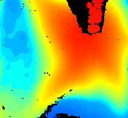
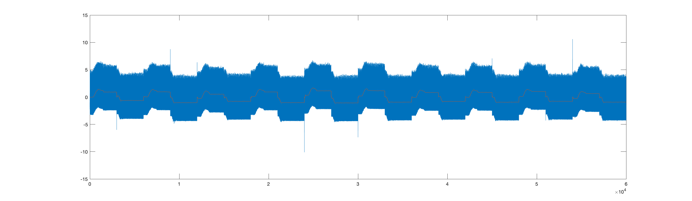
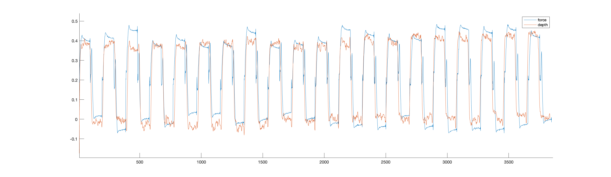

# HarVI_Depth_To_Force


This project aims to learn the relationship between the force applied to the tissue and the depth of the deformation observed and to eventually learn the relationship.

The depth is measured using an Intel Realsense camera Di435. 
<br />The force is measured through a force sensor via the Nidaq setup.

## Setup
```
CAMERA: The camera contains IR sensors that capture the depth information at 30fps.

FORCE SENSOR: The force sensor is embedded into the tip of the linear servo that gives real-time data
for forces during the motion of the servo @ 3000readings/sec.

LINEAR SERVO: The linear servo pokes the foam or the tissues and creates a palpation gesture over it.

FOAMS/TISSUES: The palpations are tested on different kinds of tissues and foams.
```
## Software Setup
```
1. MATLAB: https://www.mathworks.com/products/get-
matlab.html?s_tid=gn_getml
      a) Add On: Data acquisition Toolbox (Not availaible for MAC, only for Windows and Linux) 

2. PYTHON: https://www.python.org/download/releases/2.7/
      a) Packages Needed: Pyrealsense2, cv2, numpy 
  
3. INTEL REALSENSE SDK: https://software.intel.com/en-us/realsense/sdk
```

##### Note : As of 20th May 2020, the NiDaq add on was not available on Mac, hence the entire setup for reading force and controlling the servo was done on windows.

## Hardware Setup

The linear servo has three wires: positive (red), negative (black) and the signal (white). First connect the
positive of power supply to positive of the linear servo. Then connect the grounds of power supply,
servo and the NI-DAQ. Finally the signal is given to the NI-DAQ via MATLAB code in the system, so
connect the pin for signal to the signal wire of the linear servo. The power supply, with a voltage
between 8 Volts and force sensor box are connected to external powers. Finally, connect the NI-DAQ
to the system.

## File Structure
```
Code
  |- bag_to_images-pyreal.py
  |- Model.ipynb
  |- sampling.m
  |- servo_final.m
  |- fit_new.m

CSV
  |- Contains final force and depth values for model training

Force_Files
  |- Files created by matlab with force data

```

## File Explanation

#### bag_to_images-pyreal.py
This python file reads the bag file generated by the video recording and converts each depth frame into a depth value. It then saves each frame as a png in the Image folder and generates a CSV file (used in sampling.m) with all depth values for further use.


#### fit_new.m
This is a matlab file which processes the force files and filters the force signal to generate a filtered force csv taht is used by sampling.m.


#### sampling.m
The depth values are captured at 30fps where as the force values are captured at 3000 readings per sec. Hence, the force values are downsampled and mapped corresponding to the depth values. The final signals after mapping are stored in a CSV that are used by the model.


#### servo_final.m
This file is used to capture the data from the force sensor and move the servo. This is run on the windows machine. 

#### Model.ipynb
This Notebook implements different regression models. It has the complete implementation from preprocessing to model predection.

**Note** The final signals generated in sampling.m are filtered below 0, i.e only the upper half (>0) of the signal is kept.


## Method for collecting data
Once the setup is ready and everything is running, we collect the data by uploading the MATLAB code to
collect the data.
The MATLAB code is can be found in servo_final.m. The
comments in the code describe how each parameter is related and how data is collected.
To start collecting the data:
1. Since we collect only depth data, open the Intel Realsense SDK and switch on the stereo version
of the camera. You will see a real time colorful heat map.
2. Under configuration, set the resolution to 424x240, frame rate at 30 fps, Region of Interest at 40%
3. Move the camera such that the region of Interest (Yellow grid) is perfectly aligned and the grid lines are at 90 degrees(**Very Imp!**).
4. Enable the auto Exposure.
5. You might have to move the camera to get the best result. 
6. Try poking the surface with a tool and see change in the depth value reading in the panel on the left.
7. Click on record video button and make sure video starts before running the MATLAB file.
8. While the video runs, run the MALAB code (servo_final.m) to see the servo moving and data
collection.
9. When the matlab code finishes the number of pokes given, switch off the video recording.
10. The video recording is stored directly into the system (the path is mentioned in the bottom of
the software) and the matlab code is stored in the variable called “dd” in MATLAB environment
VARIABLES. You can right click and save the data as matlab file for later post processing.
11. The force sensor data contains 7 fields with 3 force values X,Y,Z axis and torque X,Y,Z axis and
finally a voltage value for the linear servo.


